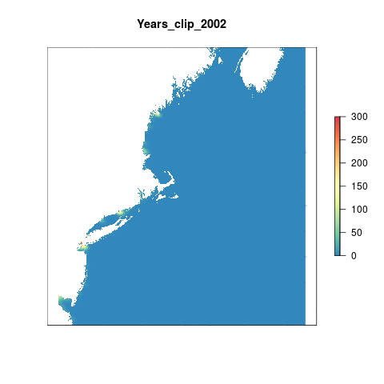

# Summary

As of now this layer is clipped from the global layers to the Northeast region and then clipped again to within 3 nautical miles offshore.

```{r setup,echo=F,message=F,warning=F}

knitr::opts_chunk$set(fig.width = 6, fig.height = 4, fig.path = 'figs/', message = FALSE, warning = FALSE)

source('~/github/ohi-northeast/src/R/common.R') ### an OHINE specific version of common.R
library(parallel)
```

#Data Source

**Reference**: 

**Downloaded**:

**Native Data Resolution**:   

**Values**:

**Time Range**: N/A

**Format**: GeoTIFF

***

# Methods

## Read in data

``` {r read_and_clip_pressure_raster}

### Nutrient pressures layers are on Mazu here:
### Mazu: marine_threats/impact_layers_2013_redo/impact_layers/work/land_based/before_2007/raw_global_results

dir_nutr <- file.path(dir_M, 'marine_threats/impact_layers_2013_redo/impact_layers',
                      'work/land_based/before_2007',
                      'raw_global_results')

nutr_files <- list.files(dir_nutr, pattern = '*fert*', full.names = TRUE)


```

## Crop

```{r crop_to_ne,eval=F}

crop_to_ne <- function(file){
  
  yr <- substr(file,137,140)
  
        raster(file)%>%
        crop(moll_ext)%>%
        projectRaster(ocean_ne,method='ngb')%>%
        mask(ocean_ne)%>%
        writeRaster(.,paste0('int/cw_nutrients_ne_clip_',yr,'.tif'),overwrite=T)
  
}

mclapply(nutr_files,crop_to_ne,mc.cores=8)

```

```{r plot}

#rasterize each file in the list of files and then create a brick of rasters
s        <- lapply(list.files('int',pattern = 'nutrients_ne_clip',full.names=T),raster)%>%brick()

names(s) <- paste0("Years_",(substr(names(s),17,25))) #rename each layer for plotting
gsub(".", "-", names(s), fixed = TRUE)                #replace the . with a -
```

```{r gif, eval=F}
library(animation)

saveGIF({
  for(i in 1:nlayers(s)){
      # don't forget to fix the zlimits
      plot(s[[i]], zlim=c(0,300), axes=F, col=cols,
           main=names(s[[i]]))
      
  }
}, movie.name = 'nutrients.gif')

```




## Clip to 3nm
```{r}

shore <- s%>%
          mask(three_nm)

```


## Rescale to 99.99th quantile
```{r quantile}

vals <- c()

for(i in 1:nlayers(shore)){
	  
	  print(i)
	  m <- shore[[i]]%>%
	    getValues()
	  
	  na.omit(m)
	  
	  vals <- c(vals,m)
	  
	}

#get the quantiles using data from the entire time series
quantile(vals, prob = c(0.9,0.95,0.99,0.999,0.9999),na.rm=T) 
  # 90%   95%   99%  100%  100% 
  # 7.7  18.6  80.0 181.6 241.4 

#let's go with the 99.9 quantile (181.6)
ref <- quantile(vals,prob = 0.999, na.rm=T)


for (i in 1:nlayers(shore)){
  
  yr <- substr(names(shore[[i]]),12,15)
  
  calc(shore[[i]], fun = function(x) {
    ifelse(x > ref, 1, x / ref)
  }) %>%
  
writeRaster(., filename = paste0('int/cw_nutrients_rescaled_',yr,'.tif'),
            overwrite = TRUE)
}

```

The reference point is `r ref`.

***

#Results

```{r extract_data}

# read in rescaled files
pressure_stack <- lapply(list.files('int',full.names=T,pattern = 'cw_nutrients_rescaled'),raster)%>%brick()

# extract data for each region (zones is previously defined in common.R)
regions_stats  <- zonal(pressure_stack,  zones, fun="mean", na.rm=TRUE, progress="text")%>%
                  data.frame()

#merge the zonal stats with the rgn_data as defined in common.R
data           <- merge(rgn_data, regions_stats, all.y=TRUE, by.x="rgn_id", by.y="zone") %>%
                    dplyr::select(-area_km2)%>%
                    gather("year", "pressure_score",starts_with("cw_nutrients_")) 

#add a year column and reformat as numeric
nutr_data <- data %>%
              mutate(year=substr(year,23, 26)) %>%
              mutate(year = as.numeric(year))

#save output data
write.csv(nutr_data, file.path("scores/nutrients.csv"), row.names=FALSE)
```

## Scores through time

```{r}
library(plotly)
time_plot <- ggplot(nutr_data,aes(x = year,y = pressure_score, col = rgn_name))+
  geom_line() +
  labs(title = "Pressure Layer: Nutrients",
       x = "Year",
       y = "Pressure Score",
       colour = "Region")
ggplotly(time_plot)
```

## Region scores

```{r current_score}

#select data from 2012
now <- read_csv("scores/nutrients.csv")%>%filter(year==2013)


#map_scores is a function to plot a tmap map of the scores
map_scores(now,'pressure_score',scale_label = "Pressure Score", map_title = "Nutrients")

```

*** 

#Citation