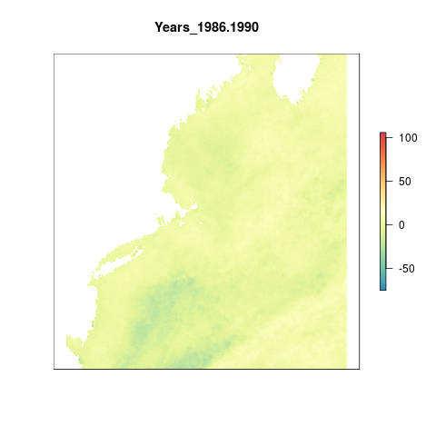
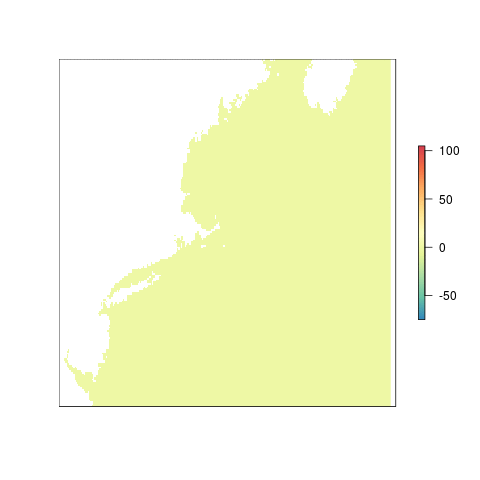

``` {r setup, echo = FALSE, message = FALSE, warning = FALSE}

knitr::opts_chunk$set(fig.width = 8, fig.height = 6, fig.path = 'figs/', message = FALSE, warning = FALSE)

source('~/github/ohi-northeast/src/R/common.R') ### an OHINE specific version of common.R

```

#Summary

For OHI Global Assessments, we calculated a climatology from 1982-2012 per cell using weekly data from CorTAD. We then calculated the number of times a given cell's weekly SST was greater than the climatological mean for that week (an anomaly: greater than mean + sd) and summed the number of anomalies in a single year. The maximum value a cell could have is 52 which would mean that cell had anomalous SST temperatures for each week of the year.

To look at change over time, we defined a historical reference period, 1985-1989, and summed the total number of anomalies per cell over that time period. Thus the maximum value a cell in the historical reference dataset could have is 52*5 = 265. For each 5 year time period from 1985 through 2012, weekly anomalies were aggregated, and then compared to the historical reference period. The final output of this comparison gets at the change in number of anomolies per cell within a 5 year time period as compared to 1985-1989.

Using the same data and methodology as Halpern et al. (2008), we created the SST pressure layer using data on Sea Surface Temperature Anomalies from [CoRTAD](https://data.nodc.noaa.gov/cgi-bin/iso?id=gov.noaa.nodc:0126774).

From the supplementary material for SST from Halpern et al. (2008):

> We first developed a climatology or long-term weekly average for each approximately ~4 km grid cell using data from 1985 to 2005. These data provide a baseline for determining when temperatures are unusually warm... we calculated the number of times the SST anomaly exceeded the
standard deviation of SSTs for that location and week of the year. This threshold-based approach accounts for natural variability at a given location, which can vary widely from place to place, by incorporating the standard deviation...

> We then developed a change metric by subtracting the number of non-zero positive anomalies in the early period (1985-1989) from the number in the recent period (2000-2005); these are the data included in our cumulative impact model.

The pressure layer is transformed from 0 to 1 using a local reference point. 

***

#Data

**Source**: The [Coral Reef Temperature Anomaly Database Version 5](https://data.nodc.noaa.gov/cgi-bin/iso?id=gov.noaa.nodc:0126774)  
**Downloaded**: May 29, 2015  
**Description**:  Sea Surface Temperature Anomalies (Kelvin)  
**Native data resolution**: 4km^2^    
**Time range**: 1982 - 2012  
**Format**:  NetCDF  

***
  
#Analysis

##Get global data from OHI 2016

We're going to use the global data that was processed for OHI 2016. This data is held in the [`ohiprep`](https://github.com/OHI-Science/ohiprep) repo on GitHub.

Each of these rasters is the difference in SST anomalies between a given 5 year period and the historical reference period (1985-1989)

```{r global_data}

sst_global_files <- list.files('~/github/ohiprep/globalprep/prs_sst/v2016/int', pattern = '.tif',full.names=T)

```

## Crop to the Northeast region

Using the `crop` function from the `raster` package we crop all sea surface temperature rasters to our extent and then reproject them to the US Albers projection for consistency across the assessment. We crop the global rasters first to reduce the time it takes to reproject the rasters.

```{r crop_to_ne, eval=F}

registerDoParallel(8)

foreach(f = sst_global_files) %dopar% {

  raster(f)%>%                     #raster the file
    crop(wgs_ext)%>%               #crop to the WGS extent 
    projectRaster(ocean_ne, filename = paste0('int/sst_anom_diffs/sst_anom_diffs_',substr(basename(f),16,24),'.tif'),overwrite=T)
    
}
```

```{r plot_anom_diffs_2008-2012, fig.cap="Difference in the number of weekly anomalies between 2008-2012 and 1985-1989"}

plot(raster('int/sst_anom_diffs/sst_anom_diffs_2008-2012.tif'),axes=F,col=cols,box=F)
plot(rgns,add=T)

```

##Visualize change over time

This gif shows yearly differences in the number of anomalous values above the reference period of 1985-1989. As an example, if a pixel has a values of 10, that indicates that pixel was anomalous for 10 more weeks in those 5 years compared to the reference period.

```{r gif1,eval=F}

#rasterize each file in the list of files and then create a brick of rasters
s        <- lapply(list.files('int/sst_anom_diffs',full.names=T),raster)%>%brick()

names(s) <- paste0("Years_",(substr(names(s),16,24))) #rename each layer for plotting
gsub(".", "-", names(s), fixed = TRUE)                #replace the . with a -

library(animation)

saveGIF({
  for(i in 1:nlayers(s)){
      # don't forget to fix the zlimits
      plot(s[[i]], zlim=c(-75,106), axes=F, col=cols,
           main=names(s[[i]]))
      
  }
}, movie.name = 'sst_anom_diffs.gif')

```



## Reference point

More than half the weeks in a 5 year period are anomalous, indicating a regime shift. This is equal to (52x5)/2, or **greater than 130**.

#### Rescale

```{r rescale_local,eval=F}

local_resc <- function(x){
  
  #get the year from the file for naming the output raster
  yrs <- substr(x,35,43)
 
  #if a cell value is greater than or equal to the reference point (130 weeks), we assign a value of 1, otherwise it is divided by the reference point
  raster(x)%>%
  calc(.,fun=function(x){ifelse(x<0,0,ifelse(x>130,1,x/ref_point_loc))},
         filename = paste0('int/sst_rescale/sst_rescale_local_',yrs,'.tif'),overwrite=T)
}

#mclapply is used for parallel processing across multiple cores
mclapply(diff_files,local_resc,mc.cores = 10)

```

#### Pressure over time

Using the local reference point, we can see how the pressure changes over time.

```{r gif_local_rescale, eval=F}

#list the rescaled rasters and assign them in a brick
resc_loc        <- lapply(list.files('int/sst_rescale',full.names=T,pattern = 'local'),raster)%>%brick()
names(resc_loc) <- paste0("Years_",(substr(names(resc_loc),19,27)))
gsub(".", "-", names(resc_loc), fixed = TRUE)

#create a gif of values over time
saveGIF({
  for(i in 1:nlayers(resc_loc)){
      # don't forget to fix the zlimits
      plot(resc_loc[[i]], zlim=c(0,1), axes=F, col=cols,
           main=names(resc_loc[[i]]))
      
  }
}, movie.name = 'sst_anom_diffs_rescale.gif')

```




***

#Results

Let's look at the results if we use a local reference point only.

## Region scores

We first need to extract the data for each of the 9 regions using the `zonal` function from the `raster` package.

```{r extract_data, eval=F}

# read in rescaled files
pressure_stack <- lapply(list.files('int/sst_rescale',full.names=T,pattern = 'local'),raster)%>%brick()

# extract data for each region (zones is previously defined in common.R)
regions_stats  <- zonal(pressure_stack,  zones, fun="mean", na.rm=TRUE, progress="text")%>%
                  data.frame()

#merge the zonal stats with the rgn_data as defined in common.R
data           <- merge(rgn_data, regions_stats, all.y=TRUE, by.x="rgn_id", by.y="zone") %>%
                    dplyr::select(-area_km2)%>%
                    gather("year", "pressure_score",starts_with("sst_rescale_local_")) 

#add a year column and reformat as numeric
sst_data <- data %>%
              mutate(year=substr(year,24, 27)) %>%
              mutate(year = as.numeric(year))

#save output data
write.csv(sst_data, file.path("output/sst.csv"), row.names=FALSE)
```

We need to save each years data individually for the OHI toolbox to run.

```{r save_data, eval=F}

# function to extract data more easily
saveData <- function(newYear){
  
  #assessYear <- newYear + 1
  criteria_year <- ~year == newYear
  
  sst  <- sst_data %>%
    filter_(criteria_year) %>%
    dplyr::select(rgn_id, pressure_score) %>%
    arrange(rgn_id)
  
  write.csv(sst, file.path(sprintf('output/sst_%s.csv', newYear)), row.names=FALSE)
}


### extract data 
for(newYear in (max(sst_data$year) - 10):(max(sst_data$year))){
  saveData(newYear)
}
```

### Current scores

Let's look at the most recent scores, which would use the data from 2012 as it's the most recent year in the CoRTAD dataset.

```{r current_score}

#select data from 2012
now <- read_csv("output/sst.csv")%>%filter(year==2012)


#map_scores is a function to plot a tmap map of the scores
map_scores(now,'pressure_score',scale_label = "Pressure Score", map_title = "Sea Surface Temperature")

```


### Visualize through time

This code chunk creates a google visualization of the scores through time. It unfortunately does not allow the google chart to show up in the RMarkdown knitted document.

```{r google_plot, results = 'asis'}

sst_data <- read_csv("output/sst.csv")

library(googleVis)
plotData <- sst_data %>%
  dplyr::select(rgn_name, year, pressure_score)

Motion=gvisMotionChart(plotData, 
                       idvar="rgn_name", 
                       timevar="year",
                       options=list(width=550, height=450))

print(Motion, 'chart',file='sst.html')

```


***

#Citation information  
Casey, Kenneth S.; Selig, Elizabeth R.; Zhang, Dexin; Saha, Korak; Krishnan, Ajay; and McMichael, Elizabeth (2015). The Coral Reef Temperature Anomaly Database (CoRTAD) Version 5 - Global, 4 km Sea Surface Temperature and Related Thermal Stress Metrics for 1982-2012 (NCEI Accession 0126774). Version 1.1. NOAA National Centers for Environmental Information. Dataset. doi:10.7289/V5CZ3545 Accessed: May 29, 2015.

Selig, E.R., K.S. Casey, and J.F. Bruno (2010), New insights into global patterns of ocean temperature anomalies: implications for coral reef health and management, Global Ecology and Biogeography, DOI: 10.1111/j.1466-8238.2009.00522.x.