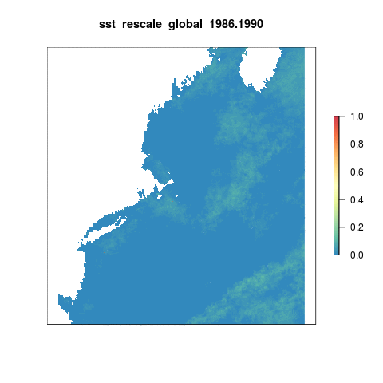

``` {r setup, echo = FALSE, message = FALSE, warning = FALSE}

knitr::opts_chunk$set(fig.width = 8, fig.height = 6, fig.path = 'figs/', message = FALSE, warning = FALSE)

source('~/github/ohi-northeast/src/R/common.R') ### an OHINE specific version of common.R

```

#Summary

Using the same data and methodology as Halpern et al. (2008), we created the SST pressure layer using data on Sea Surface Temperature Anomalies from [CoRTAD](https://data.nodc.noaa.gov/cgi-bin/iso?id=gov.noaa.nodc:0126774).

From the supplementary material for SST from Halpern et al. (2008):

> We first developed a climatology or long-term weekly average for each approximately ~4 km grid cell using data from 1985 to 2005. These data provide a baseline for determining when temperatures are unusually warm... we calculated the number of times the SST anomaly exceeded the
standard deviation of SSTs for that location and week of the year. This threshold-based approach accounts for natural variability at a given location, which can vary widely from place to place, by incorporating the standard deviation...

> We then developed a change metric by subtracting the number of non-zero positive anomalies in the early period (1985-1990) from the number in the recent period (2000-2005); these are the data included in our cumulative impact model.

With the updated data, our recent period is 2008-2012.

The pressure layer is transformed from 0 to 1 using a local reference point. 

***

#Data Source

**Reference(s)**: The [Coral Reef Temperature Anomaly Database Version 5](https://data.nodc.noaa.gov/cgi-bin/iso?id=gov.noaa.nodc:0126774)  
**Downloaded**: May 29, 2015  
**Description**:  Sea Surface Temperature Anomalies (Kelvin)  
**Native data resolution**: 4km^2^    
**Time range**: 1982 - 2012  
**Format**:  NetCDF  

***
  
#Methods

##Get global data from OHI 2016

Read in the global data used for OHI 2016.
```{r global_data}

#each of these rasters is the difference in SST anomalies between a given 5 year period and the historical reference period (1985-1990)
sst_global_files <- list.files('~/github/ohiprep/globalprep/prs_sst/v2016/int', pattern = '.tif',full.names=T)

```

##Crop all files to the northeast region

For OHI Global we calculated a climatology from 1982-2012 per cell using weekly data from CorTAD. We then calculated the number of times a given cell's weekly SST was greater than the climatological mean for that week (an anomaly: greater than mean + sd) and summed the number of anomalies in a single year. The maximum value a cell could have is 52 which would mean that cell had anomalous SST temperatures for each week of the year.

To look at change over time, we defined a historical reference period, 1985-1989, and summed the total number of anomalies per cell over that time period. Thus the maximum value a cell in the historical reference dataset could have is 52*5 = 265. For each 5 year time period from 1985 through 2012, weekly anomalies were aggregated, and then compared to the historical reference period. The final output of this comparison gets at the change in #of anomolies per cell within a 5 year time period as compared to 1985-1990.

```{r crop_to_ne, eval=F}

#get difference in anomalies for the NE region

# lapply(sst_global_files, cropPressure,rgn_crs = us_alb, rgn_ext = ne_ext, filename = paste0('int/sst_anom_diffs_',substr(sst_global_files,77,85),'.tif'))

registerDoParallel(8)

foreach(f = sst_global_files) %dopar% {

  raster(f)%>%                     #raster the file
    crop(wgs_ext)%>%               #crop to the WGS extent 
    projectRaster(ocean_ne, filename = paste0('int/sst_anom_diffs/sst_anom_diffs_',substr(f,77,85),'.tif'),overwrite=T) #projectRaster to US albers (crop first to reduce time in reprojecting)
    
}
```

```{r plot_anom_diffs_2008-2012, fig.cap="Difference in the number of weekly anomalies between 2008-2012 and 1985-1989"}

plot(raster('int/sst_anom_diffs/sst_anom_diffs_2008-2012.tif'),axes=F,col=cols,box=F)
plot(rgns,add=T)

```

##Visualize change over time

This gif shows yearly differences in the number of anomalous values above the reference period of 1985-1989. As an example, if a pixel has a values of 10, that indicates that pixel was anomalous for 10 more weeks in those 5 years compared to the reference period.

```{r,eval=F}

s <- lapply(list.files('int/sst_anom_diffs',full.names=T),raster)%>%brick()
names(s) <- paste0("Years_",(substr(names(s),16,24)))
gsub(".", "-", names(s), fixed = TRUE)
library(animation)

saveGIF({
  for(i in 1:nlayers(s)){
      # don't forget to fix the zlimits
      plot(s[[i]], zlim=c(-75,106), axes=F, col=cols,
           main=names(s[[i]]))
      
  }
}, movie.name = 'sst_anom_diffs.gif')

```


## Set Reference point

Calculates both a local and global reference point across the entire time series.

```{r}

ref_point <- max(sst_global_files%>%stack()%>%cellStats(stat='max'))

ref_point_loc <- max(sst_global_files%>%
                  stack()%>%
                  crop(wgs_ext)%>%
                  projectRaster(ocean_ne)%>%
                  cellStats(stat='max'))
```

## Rescale 

### Using a global reference point

```{r rescale_global,eval=F}

diff_files <- list.files('int/sst_anom_diffs',full.names=T)

global_resc <- function(x){
  
  yrs <- substr(x,35,43)
 raster(x)%>%
        calc(.,fun=function(x){ifelse(x<0,0,ifelse(x>ref_point,1,x/ref_point))},
         filename = paste0('int/sst_rescale/sst_rescale_global_',yrs,'.tif'),overwrite=T)
}

mclapply(diff_files,global_resc,mc.cores = 10)

```

The global reference point is set equal to the maximum value anywhere in the world across the entire time series and is a difference of **`r ref_point`** anomalies in a 5 year period.

```{r,eval=F}

resc_glob <- lapply(list.files('int/sst_rescale',full.names=T,pattern = 'global'),raster)%>%brick()

saveGIF({
  for(i in 1:nlayers(resc_glob)){
      # don't forget to fix the zlimits
      plot(resc_glob[[i]], zlim=c(0,1), axes=F, col=cols,
           main=names(resc_glob[[i]])) 
      
  }
}, movie.name = 'sst_anom_diffs_rescale_global.gif')

```



### Using a local reference point

```{r rescale_local,eval=F}

local_resc <- function(x){
  
  yrs <- substr(x,35,43)
 raster(x)%>%
        calc(.,fun=function(x){ifelse(x<0,0,ifelse(x>ref_point_loc,1,x/ref_point_loc))},
         filename = paste0('int/sst_rescale/sst_rescale_local_',yrs,'.tif'),overwrite=T)
}

mclapply(diff_files,local_resc,mc.cores = 10)

```

The local reference point is set equal to the maximum value within the Northeast region across the entire time series. This is not necessarily the maximum within our regions, but the maximum value within the larger extent of our region. The reference point is a difference of **`r ref_point_loc`** anomalies in a 5 year period.

```{r,eval=F}

resc_loc <- lapply(list.files('int/sst_rescale',full.names=T,pattern = 'local'),raster)%>%brick()
names(resc_loc) <- paste0("Years_",(substr(names(resc_loc),19,27)))
gsub(".", "-", names(resc_loc), fixed = TRUE)

saveGIF({
  for(i in 1:nlayers(resc_loc)){
      # don't forget to fix the zlimits
      plot(resc_loc[[i]], zlim=c(0,1), axes=F, col=cols,
           main=names(resc_loc[[i]]))
      
  }
}, movie.name = 'sst_anom_diffs_rescale_local.gif')

```


***

#Results

Sticking with using a local reference point.

## Region scores

```{r extract_data}

## Extract data for each region

# read in raster files
pressure_stack <- lapply(list.files('int/sst_rescale',full.names=T,pattern = 'local'),raster)%>%brick()

# extract data for each region:
regions_stats <- zonal(pressure_stack,  zones, fun="mean", na.rm=TRUE, progress="text")
regions_stats2 <- data.frame(regions_stats)

data <- merge(rgn_data, regions_stats, all.y=TRUE, by.x="rgn_id", by.y="zone") %>%
          dplyr::select(-area_km2)%>%
  gather("year", "pressure_score",starts_with("sst_rescale_local_")) 

sst_data <- data %>%
  mutate(year=substr(year,24, 27)) %>%
  mutate(year = as.numeric(year))

write.csv(sst_data, file.path("int/slr.csv"), row.names=FALSE)

## save toolbox data for different years/regions

# function to extract data more easily
saveData <- function(newYear){
  
  #assessYear <- newYear + 1
  criteria_year <- ~year == newYear
  
  sst  <- sst_data %>%
    filter_(criteria_year) %>%
    dplyr::select(rgn_id, pressure_score) %>%
    arrange(rgn_id)
  
  write.csv(sst, file.path(sprintf('out/sst_%s.csv', newYear)), row.names=FALSE)
}


### extract data 
for(newYear in (max(sst_data$year) - 10):(max(sst_data$year))){
  saveData(newYear)
}
```

### Current scores

```{r current_score}

now <- sst_data%>%filter(year==2012)

rgns_sst <- rgns
rgns_sst@data <- rgns_sst@data%>%left_join(now)

map <- subs(ocean_rgns,rgns_sst@data, by = "rgn_id", which = "pressure_score")

plot(ocean_ne,col='lightblue',axes=F,legend=F,main = "SST Pressure Score - most recent year (2012)")
plot(map,col=cols,axes=F,add=T,box=F)
plot(ne_states,add=T,col='cornsilk1',border=F)
```


### Visualize through time
```{r google_plot}
library(googleVis)
plotData <- sst_data %>%
  dplyr::select(rgn_name, year, pressure_score)

Motion=gvisMotionChart(plotData, 
                       idvar="rgn_name", 
                       timevar="year")
plot(Motion)

print(Motion, file='slr.html')

```

***

#Citation information  
Casey, Kenneth S.; Selig, Elizabeth R.; Zhang, Dexin; Saha, Korak; Krishnan, Ajay; and McMichael, Elizabeth (2015). The Coral Reef Temperature Anomaly Database (CoRTAD) Version 5 - Global, 4 km Sea Surface Temperature and Related Thermal Stress Metrics for 1982-2012 (NCEI Accession 0126774). Version 1.1. NOAA National Centers for Environmental Information. Dataset. doi:10.7289/V5CZ3545 Accessed: May 29, 2015.

Selig, E.R., K.S. Casey, and J.F. Bruno (2010), New insights into global patterns of ocean temperature anomalies: implications for coral reef health and management, Global Ecology and Biogeography, DOI: 10.1111/j.1466-8238.2009.00522.x.