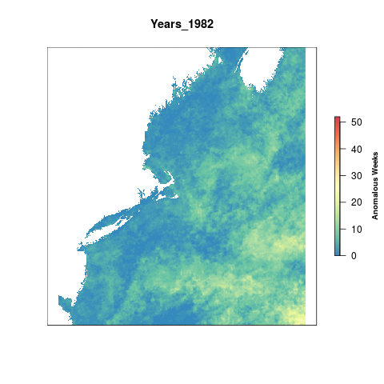
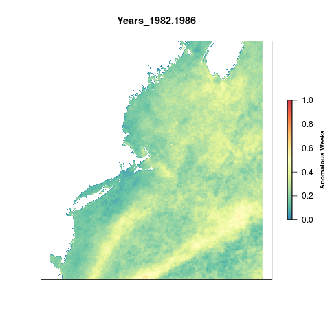

``` {r setup, echo = FALSE, message = FALSE, warning = FALSE}

knitr::opts_chunk$set(fig.width = 8, fig.height = 6, fig.path = 'figs/', message = FALSE, warning = FALSE)

source('~/github/ohi-northeast/src/R/common.R') ### an OHINE specific version of common.R

```

#Summary

For OHI Global Assessments, we calculated a climatology from 1982-2012 per cell using weekly data from CorTAD. We then calculated the number of times a given cell's weekly SST was greater than the climatological mean for that week (an anomaly: greater than mean + one standard deviation) and summed the number of weekly anomalies in a single year. The maximum value a cell could have is 52 which would mean that cell had anomalous SST temperatures for each week of the year.

To account for annual variation, we look at Sea Surface Temperature anomalies in 5 year periods, so the maximum value possible per cell is 260 anomalous weeks. To rescale the values from 0 to 1 we set a reference point. Previously, the reference point for SST has just been the maximum difference in anomalous weeks between the most recent time period and a historical reference period (1985-1989).

This time we have decided to use a reference point that represents a regime shift. Once a given cell is anomalous for more than 50% of a five-year period, it has shifted into a new regime. All cells that have a value greater than 130 weeks (51% of a 5 year time period) are assigned a 1. The rest of the cells are scaled to this reference point by dividing by 130.


***

#Data

**Source**: The [Coral Reef Temperature Anomaly Database Version 5 (CoRTAD)](https://data.nodc.noaa.gov/cgi-bin/iso?id=gov.noaa.nodc:0126774)  
**Downloaded**: May 29, 2015  
**Description**:  Sea Surface Temperature Anomalies (Kelvin)  
**Native data resolution**: 4km^2^    
**Time range**: 1982 - 2012  
**Format**:  NetCDF  

***
  
#Analysis

##Global data layers

We're going to use the global data that was processed for OHI 2015 & used for OHI 2016. This data is held on a server at NCEAS.

Each of these rasters is the number of positive weekly anomalies each year.

```{r global_data}

sst_global_files <- list.files(file.path(dir_M,'git-annex/globalprep/prs_sst/v2015/tmp'), pattern = 'annual_pos_anomalies',full.names=T)

plot(raster(sst_global_files[31]),col=cols,main = "Sea Surface Temperature 2012",box=F,axes=F,
     legend.args=list(text='Anomalous Weeks', side=4, font=2, line=2.5, cex=0.8))

```

## Crop to the Northeast region

Using the `crop` function from the `raster` package we crop all sea surface temperature rasters to our extent and then reproject them to the US Albers projection for consistency across the assessment. We crop the global rasters first to reduce the time it takes to reproject the rasters. `ocean_ne` is used as a mask to remove land cells from the raster for better visuals.

```{r crop_to_ne, eval=F}

registerDoParallel(10)

foreach(f = sst_global_files) %dopar% {

  raster(f)%>%                     #raster the file
    crop(wgs_ext)%>%               #crop to the WGS extent 
    projectRaster(ocean_ne)%>%
    mask(ocean_ne, filename = paste0(file.path(dir_anx),'/prs_sst/output/sst_annual_anoms/annual_anoms_',substr(basename(f), 25, 28),'.tif'), overwrite = T)
    
}

plot(raster(file.path(dir_anx, 'prs_sst/output/sst_annual_anoms/annual_anoms_2012.tif')),col=cols, axes=F, main = "Sea Surface Temperature 2012",
     legend.args=list(text='Anomalous Weeks', side=4, font=2, line=2.5, cex=0.8))
```


##Visualize change over time

Getting a sense of how things have changed over time.

```{r gif1, eval=F}

#rasterize each file in the list of files and then create a brick of rasters
s <- lapply(list.files(file.path(dir_anx, 'prs_sst/output/sst_annual_anoms'), full.names=T), raster) %>%
  brick()

names(s) <- paste0("Years_",(substr(names(s), 14, 17))) #rename each layer for plotting
gsub(".", "-", names(s), fixed = TRUE)                #replace the . with a -

library(animation)

saveGIF({
  for(i in 1:nlayers(s)){
      # don't forget to fix the zlimits
      plot(s[[i]], zlim=c(0,52), axes=F, col=cols,
           main=names(s[[i]]),
           legend.args=list(text='Anomalous Weeks', side=4, font=2, line=2.5, cex=0.8))
      
  }
}, movie.name = 'sst_annual_anoms.gif')

```



##Five-year aggregates

Calculating total anomalous weeks for each 5-year period from 1982 - 2012.

```{r five-year}

l <- list.files(file.path(dir_anx, 'prs_sst/output/sst_annual_anoms'), full.names=T)

for(i in 1982:2008){ #i=2005
  
  yrs <- c(i, i+1,i+2, i+3, i+4)
  s   <- stack(l[substr(l, 80, 83)%in%yrs]) %>%
    sum(.)
  
  writeRaster(s, filename = paste0(dir_anx, '/prs_sst/output/sst_5yr_anom_sums/sum_anoms_', min(yrs), '-', max(yrs), '.tif'), overwrite=T)
}

```

## Rescale

To account for annual variation, we look at Sea Surface Temperature anomalies in 5 year periods, so the maximum value possible per cell is 260 anomalous weeks. To rescale the values from 0 to 1 we need to set a reference point. Previously, the reference point for SST has just been the maximum difference in anomalous weeks between the most recent time period and a historical reference period (1985-1989).

This time we have decided to use a reference point that represents a regime shift. Once a given cell is anomalous for more than 50% of a five-year period, it has shifted into a new regime. All cells that have a value greater than 130 weeks (51% of a 5 year time period) are assigned a 1. The rest of the cells are scaled to this reference point by dividing by 130.


```{r rescale,eval=F}

sst_aggs <- list.files(file.path(dir_anx, 'prs_sst/output/sst_5yr_anom_sums'), full.names=T) 

resc_func <- function(x){
  
  #get the year from the file for naming the output raster
  yrs <- substr(x, 78, 86)
 
  #if a cell value is greater than or equal to the reference point (130 weeks), we assign a value of 1, otherwise it is divided by the reference point
  raster(x)%>%
  calc(., fun=function(x){ifelse(x < 0, 0, ifelse(x > 130, 1, x/130))},
         filename = paste0(dir_anx, '/prs_sst/output/sst_rescale/sst_rescale_', yrs, '.tif'), overwrite=T)
}

foreach(file = sst_aggs) %dopar%{
  resc_func(file)
}


```

### Pressure over time

Using the local reference point, we can see how the pressure changes over time.

```{r gif_local_rescale, eval=F}

#list the rescaled rasters and assign them in a brick
resc      <- lapply(list.files(file.path(dir_anx, 'prs_sst/output/sst_rescale'), full.names=T), raster)%>%
                      brick()
names(resc) <- paste0("Years_",(substr(names(resc),13,21)))
gsub(".", "-", names(resc), fixed = TRUE)

#create a gif of values over time
saveGIF({
  for(i in 1:nlayers(resc)){
      # don't forget to fix the zlimits
      plot(resc[[i]], zlim=c(0,1), axes=F, col=cols,
           main=names(resc[[i]]),
           legend.args=list(text='Anomalous Weeks', side=4, font=2, line=2.5, cex=0.8))
      
  }
}, movie.name = 'sst_rescale.gif')

```




***

#Results

## Region scores

By extracting the data for each of the 9 regions using the `zonal` function from the `raster` package we can get the mean score per region.

```{r extract_data, eval=F}

# read in rescaled files
pressure_stack <- lapply(list.files(file.path(dir_anx, 'prs_sst/output/sst_rescale'),full.names=T), raster)%>%
  brick()

# extract data for each region (zones is previously defined in common.R)
regions_stats  <- zonal(pressure_stack,  zones, fun="mean", na.rm=TRUE, progress="text")%>%
                  data.frame()

#merge the zonal stats with the rgn_data as defined in common.R
data           <- merge(rgn_data, regions_stats, all.y=TRUE, by.x="rgn_id", by.y="zone") %>%
                    dplyr::select(-area_km2)%>%
                    gather("year", "pressure_score", starts_with("sst_rescale_")) 

#add a year column that grabs the last year of the 5 year period and reformat as numeric
sst_data <- data %>%
              mutate(year=substr(year,18, 21)) %>%
              mutate(year = as.numeric(year))

#save output data
write.csv(sst_data, file.path("output/sst.csv"), row.names=FALSE)
```

Each year is saved individually for the OHI toolbox.

```{r save_data, eval=F}

# function to extract data more easily
saveData <- function(newYear){
  
  #assessYear <- newYear + 1
  criteria_year <- ~year == newYear
  
  sst  <- sst_data %>%
    filter_(criteria_year) %>%
    dplyr::select(rgn_id, pressure_score) %>%
    arrange(rgn_id)
  
  write.csv(sst, file.path(sprintf('output/sst_%s.csv', newYear)), row.names=FALSE)
}


### extract data 
for(newYear in (max(sst_data$year) - 10):(max(sst_data$year))){
  saveData(newYear)
}
```

## Current scores

Let's look at the most recent scores using the data from 2012 since it's the most recent year in the CoRTAD dataset.

```{r current_score}

#select data from 2012
now <- read.csv("output/sst.csv")%>%filter(year==2012)


#map_scores is a function to plot a tmap map of the scores
map_scores(now,'pressure_score',scale_label = "Pressure Score", map_title = "Sea Surface Temperature")

```


## Region scores through time


```{r ggplot_time}
library(ggplot2)
sst_data <- read_csv("output/sst.csv")

ggplot(sst_data,aes(x = year,y = pressure_score, color = rgn_name))+
  geom_line()+
  labs(color = "Region")

```

This code chunk creates a google visualization of the scores through time. It unfortunately does not allow the google chart to show up in the RMarkdown knitted document.

```{r google_plot, results = 'asis'}

library(googleVis)
plotData <- sst_data %>%
  dplyr::select(rgn_name, year, pressure_score)

Motion=gvisMotionChart(plotData, 
                       idvar="rgn_name", 
                       timevar="year",
                       options=list(width=550, height=450))

print(Motion, 'chart',file='sst.html')

```


***

#Citation information  
Casey, Kenneth S.; Selig, Elizabeth R.; Zhang, Dexin; Saha, Korak; Krishnan, Ajay; and McMichael, Elizabeth (2015). The Coral Reef Temperature Anomaly Database (CoRTAD) Version 5 - Global, 4 km Sea Surface Temperature and Related Thermal Stress Metrics for 1982-2012 (NCEI Accession 0126774). Version 1.1. NOAA National Centers for Environmental Information. Dataset. doi:10.7289/V5CZ3545 Accessed: May 29, 2015.

Selig, E.R., K.S. Casey, and J.F. Bruno (2010), New insights into global patterns of ocean temperature anomalies: implications for coral reef health and management, Global Ecology and Biogeography, DOI: 10.1111/j.1466-8238.2009.00522.x.