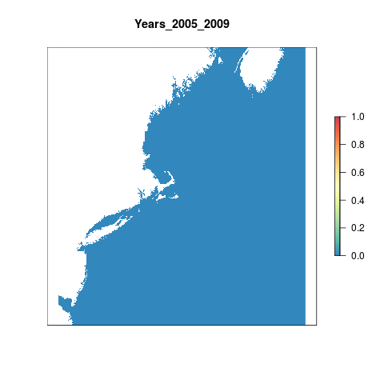

#Summary

The Ultraviolet Radiation pressure layer is generated from daily data on Local Noon Erythemal UV Irradiance (mW/m2) derived from satellite observations. 

For the global OHI assessment, the raw data is processed into anomaly products. The data product of that process are rasters of total number of weekly anomalies per year. An anomaly is defined as greater than the mean climatology plus 1 standard deviation for that cell across the entire dataset (2005-2016).

This script takes the global anomaly rasters, crops them to the Northeast region and calculates the difference in the number of weekly anomalies over each 5 year period compared to the number of anomalies in the period 2005 to 2009. The data is then rescaled using the maximum number of anomalies above the reference period.


***

# Data

**Reference**: The Ultraviolet Radiation pressures layer uses the [Aura OMI GLobal Surface UVB Data Product](https://disc.gsfc.nasa.gov/uui/datasets/OMUVBG_V003/summary#).  
**Native Data Resolution**: 0.25 degrees
**Values**: OMI/Aura Surface UVB Irradiance and Erythemal Dose Daily L2 Global Gridded 0.25 degree x 0.25 degree V3 
**Time Range**: Daily data from 2005 - 2016 
**Format**: HDF5  

***
  
#Analysis

```{r setup, message = F, warning = F, echo=F}

knitr::opts_chunk$set(message = FALSE, warning = FALSE,verbose=F)

source('~/github/ohi-northeast/src/R/common.R')

```

## Global data

First we identify the global data layers we will be using to clip to the Northeast.

```{r global_uv_data}

anom_files <- list.files(file.path(dir_M,'git-annex/globalprep/prs_uv/v2017/int/annual_anoms'),full.names = T)

```

## Crop to our region

`crop_to_ne` is a function that crops each raster in a list to the northeast region extent.

```{r crop_to_ne, eval=F}

crop_to_ne <- function(file){
  
  yr <- substr(file,90,93)
  
        raster(file)%>%
        crop(wgs_ext)%>%
        projectRaster(ocean_ne,method='ngb')%>%
        mask(ocean_ne)%>%
        writeRaster(.,paste0('int/annual_anom_',yr,'.tif'),overwrite=T)
  
}

lapply(anom_files,crop_to_ne)

```
    
```{r plot}

plot(raster('int/annual_anom_2016.tif'),col=cols,main = "Number of anomalous weeks 2016")

```
    
    
    
## Calculate differences

Calculate the difference in total number of anomalies compared to the first 5 years (2005-2009). This is done for each 5-year period in our time series.

```{r calc_differences, eval=F}

l   <- list.files('int',pattern = 'anom',full.names=T)

ref <- list.files('int',full.names=T)[1:5]%>%stack()%>%
        calc(.,fun=function(x){sum(x,na.rm=T)})

registerDoParallel(8) #set 5 cores to do parallel processing

foreach(i = c(2005:2012)) %dopar% { #i=2005

  yrs <- c(i:(i+4))
  
  s   <- stack(l[substr(l,17,20)%in%yrs])%>%sum(.,na.rm=T)

  diff = s - ref #calculate difference between total number of anomalies in recent and historical (2005-2009) time periods

  out = mask(diff,ocean_ne, filename =paste0('int/annual_diff_ocean_',yrs[1], '_', yrs[5],'.tif'),overwrite=T)
}

```

```{r plot2}

plot(raster('int/annual_diff_ocean_2012_2016.tif'),col=cols, main = "Difference in number of anomalies \n between 2012 - 2016 and 2005 - 2009")

```

## Rescale

### Using a local reference point

Rescale using the maximum value across all years from within the region bounding box. This is being explored currently. We may switch to a different spatial reference point.

```{r rescale, eval=F}

out_files <- list.files('int',full.names=T, pattern = 'ocean')

#get data across all years
vals <- c()

for(i in 1:8){
  
  print(i)
  m <- out_files[i]%>%
    raster()%>%
    getValues()
  
  na.omit(m)
  
  vals <- c(vals,m)
  
}

#local rescaling 
loc_resc  <- max(vals,na.rm=T)#70


foreach(i = c(2005:2012)) %dopar% { #i=2005
  
 yrs <- c(i:(i+4))
 
  out_rescale = out_files[substr(out_files,23,26)==i]%>%
                raster()%>%
                calc(fun=function(x){ifelse(x>0,ifelse(x>loc_resc,1,x/loc_resc),0)})%>%
                mask(ocean_ne,filename=paste0('output/',min(yrs),'_',max(yrs),'_rescaled.tif',sep=""),overwrite=T)
}
```

```{r plot_loc_rescale}
plot(raster('output/2012_2016_rescaled.tif'),col=cols,main = "UV pressure layer 2016 \n Local Reference Point")

```

### Using a global reference point

Using the maximum value globally to rescale. This requires reading in the global anomalies from ohiprep.

```{r global_rescale, eval=F}

glob_files <- list.files('~/github/ohiprep/globalprep/prs_uv/v2017/int',full.names=T)
vals <- c()

for(i in 1:7){
  
  print(i)
  m <- glob_files[i]%>%
    raster()%>%
    getValues()
  
  na.omit(m)
  
  vals <- c(vals,m)
}

global_resc <- max(vals,na.rm=T)#100
  
foreach(i = c(2005:2012)) %dopar% { #i=2005
  
 yrs <- c(i:(i+4))
 
  out_rescale = out_files[substr(out_files,23,26)==i]%>%
                raster()%>%
                calc(fun=function(x){ifelse(x>0,ifelse(x>global_resc,1,x/global_resc),0)})%>%
                mask(ocean_ne,filename=paste0('output/',min(yrs),'_',max(yrs),'_rescaled_global.tif',sep=""),overwrite=T)
}

```


***

# Results

Sticking with using a local reference point.


##Extract data for each region

```{r extract_region_results, eval=F}

# get rescaled data: (using the locally rescaled ones for now)
rast_stack <- list.files('output',pattern = 'rescaled.tif',full.names=T)%>%stack()

# extract data for each region:
regions_stats <- zonal(rast_stack,  zones, fun="mean", na.rm=TRUE, progress="text")%>%data.frame()

data <- merge(rgn_data, regions_stats, all.y=TRUE, by.x="rgn_id", by.y="zone") %>%
          dplyr::select(-area_km2)%>%
  gather("year", "pressure_score",starts_with("X20")) 

uv_data <- data %>%
  mutate(year=substr(year,7,10)) %>%
  mutate(year = as.numeric(year))

write.csv(uv_data, "output/uv.csv", row.names=FALSE)
```


```{r gif, eval=F}
library(animation)
resc_loc <- lapply(list.files('output',full.names=T,pattern = 'rescaled.tif'),raster)%>%brick()
names(resc_loc) <- paste0("Years_",(substr(names(resc_loc),2,10)))
gsub(".", "-", names(resc_loc), fixed = TRUE)

saveGIF({
  for(i in 1:nlayers(resc_loc)){
      # don't forget to fix the zlimits
      plot(resc_loc[[i]], zlim=c(0,1), axes=F, col=cols,
           main=names(resc_loc[[i]]))
      
  }
}, movie.name = 'uv_rescaled.gif')

```


Using globally rescaled data
```{r extract_region_results_global, eval=F}

# get rescaled data: (using the locally rescaled ones for now)
rast_stack <- list.files('output',pattern = 'rescaled_global.tif',full.names=T)%>%stack()

# extract data for each region:
regions_stats <- zonal(rast_stack,  zones, fun="mean", na.rm=TRUE, progress="text")%>%data.frame()

data <- merge(rgn_data, regions_stats, all.y=TRUE, by.x="rgn_id", by.y="zone") %>%
          dplyr::select(-area_km2)%>%
  gather("year", "pressure_score",starts_with("X20")) 

uv_data <- data %>%
  mutate(year=substr(year,7,10)) %>%
  mutate(year = as.numeric(year))

write.csv(uv_data, "output/uv_globalrescale.csv", row.names=FALSE)
```


```{r global_gif, eval=F}
library(animation)
resc_glob <- lapply(list.files('output',full.names=T,pattern = 'rescaled_global'),raster)%>%brick()
names(resc_glob) <- paste0("Years_",(substr(names(resc_glob),2,10)))
gsub(".", "-", names(resc_glob), fixed = TRUE)

saveGIF({
  for(i in 1:nlayers(resc_glob)){
      # don't forget to fix the zlimits
      plot(resc_glob[[i]], zlim=c(0,1), axes=F, col=cols,
           main=names(resc_glob[[i]]))
      
  }
}, movie.name = 'uv_rescaled_global.gif')

```


***
Save toolbox data for different years/regions

```{r, eval=F}

# function to extract data more easily
uv_data <- read.csv("output/uv.csv")

saveData <- function(newYear){ # newYear= 2012
  
  criteria_year <- ~year == newYear

    uv  <- uv_data %>%
      filter_(criteria_year) %>%
      dplyr::select(rgn_id, pressure_score) %>%
      arrange(rgn_id)
  
  write.csv(uv, sprintf('output/uv_%s.csv', newYear), row.names=FALSE)
}


### extract data 
for(newYear in (min(uv_data$year)):(max(uv_data$year))){
  saveData(newYear)
}


### try visualizing the data using googleVis plot
library(googleVis)
plotData <- uv_data %>%
  dplyr::select(rgn_name, year, pressure_score)

Motion=gvisMotionChart(plotData, 
                       idvar="rgn_name", 
                       timevar="year")
plot(Motion)

print(Motion, file='uv.html')

```


***

# Citation information  

Jari Hovila, Antii Arola, and Johanna Tamminen (2014), OMI/Aura Surface UVB Irradiance and Erythemal Dose Daily L2 Global Gridded 0.25 degree x 0.25 degree V3, NASA Goddard Space Flight Center, Goddard Earth Sciences Data and Information Services Center (GES DISC), Accessed [February 5, 2017] DOI:10.5067/Aura/OMI/DATA2028