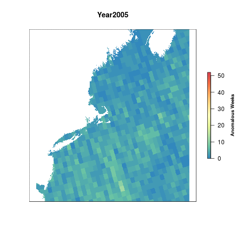
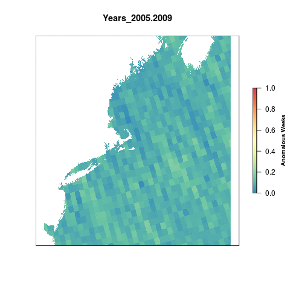

#Summary

The Ultraviolet Radiation pressure layer is generated from daily data on Local Noon Erythemal UV Irradiance (mW/m2) derived from satellite observations. 

For the global OHI assessment, the raw data is processed into anomaly products. The data product of that process are rasters of total number of weekly anomalies per year. An anomaly is defined as greater than the mean climatology plus 1 standard deviation for that cell across the entire dataset (2005-2016).

This script takes the global anomaly rasters, crops them to the Northeast region. This time we have decided to use a reference point that represents a regime shift. Once a given cell is anomalous for more than 50% of a five-year period, it has shifted into a new regime. All cells that have a value greater than 130 weeks (51% of a 5 year time period) are assigned a 1. The rest of the cells are scaled to this reference point by dividing by 130.


***

# Data

**Reference**: The Ultraviolet Radiation pressures layer uses the [Aura OMI GLobal Surface UVB Data Product](https://disc.gsfc.nasa.gov/uui/datasets/OMUVBG_V003/summary#).  
**Native Data Resolution**: 0.25 degrees  
**Values**: OMI/Aura Surface UVB Irradiance and Erythemal Dose Daily L2 Global Gridded 0.25 degree x 0.25 degree V3  
**Time Range**: Daily data from 2005 - 2016  
**Format**: HDF5   

***
  
```{r setup, message = F, warning = F, echo=F}

knitr::opts_chunk$set(message = FALSE, warning = FALSE,verbose=F)

source('~/github/ohi-northeast/src/R/common.R')

```

***

#Analysis

## Global data

We're going to use the global data that was processed for OHI 2015 & used for OHI 2016. This data is held on a server at NCEAS.

First we identify the global data layers we will be using to clip to the Northeast.

```{r global_uv_data}

anom_files <- list.files(file.path(dir_M, 'git-annex/globalprep/prs_uv/v2017/int/annual_anoms'), full.names = T)

library(rworldmap)
world = getMap()

plot(raster(anom_files[12]), col=cols, main = "UV Radiation Anomalies 2016", box=F, axes=F,
     legend.args=list(text='Anomalous Weeks', side=4, font=2, line=2.5, cex=0.8))

plot(world, col='black', add=T)

```

## Crop to the Northeast region

Using the `crop` function from the `raster` package we crop all uv rasters to our extent and then reproject them to the US Albers projection for consistency across the assessment. We crop the global rasters first to reduce the time it takes to reproject the rasters. `ocean_ne` is used as a mask to remove land cells from the raster for better visuals.


```{r crop_to_ne, eval=F}

registerDoParallel(10) #register 8 cores for parallel processing

foreach(f = anom_files) %dopar% {
  
  raster(f)%>%
    crop(wgs_ext)%>%  #the northeast region in wgs projection
    projectRaster(ocean_ne, method = 'ngb')%>%
    mask(ocean_ne, filename = paste0(dir_anx, '/prs_uv/output/annual_anoms/annual_anom_', substr(basename(f), 22, 25),'.tif'),overwrite=T)
  
}

```
    
```{r plot}

plot(raster(file.path(dir_anx, 'prs_uv/output/annual_anoms/annual_anom_2016.tif')), col=cols, 
     main = "Ultraviolet Radiation 2016", legend.args=list(text='Anomalous Weeks', side=4, font=2, line=2.5, cex=0.8))

```
    
    
    
##Visualize change over time

Getting a sense of how things have changed over time.

```{r gif1, eval=F}

l <- lapply(list.files(file.path(dir_anx, "prs_uv/output/annual_anoms"), full.names=T), raster)%>%
                brick()

names(l) <- paste0("Year", (substr(names(l),13,16))) #rename each layer for plotting

library(animation)

saveGIF({
  for(i in 1:nlayers(l)){
      # don't forget to fix the zlimits
      plot(l[[i]], zlim=c(0,52), axes=F, col=cols,
           main=names(l[[i]]),
           legend.args=list(text='Anomalous Weeks', side=4, font=2, line=2.5, cex=0.8))
      
  }
}, movie.name = 'uv_annual_anoms.gif')
```




##Five-year aggregates

Calculating total anomalous weeks for each 5-year period from 2005 - 2016

```{r five-year, eval=F}

l <- list.files(file.path(dir_anx, "prs_uv/output/annual_anoms"), full.names=T)

for(i in 2005:2012){ #i=2005
  
  yrs <- c(i,i+1,i+2,i+3,i+4)
  s   <- stack(l[substr(basename(l), 13, 16)%in%yrs]) %>%
    sum(.)
  
  writeRaster(s, filename = paste0(dir_anx, "/prs_uv/output/sum_anoms/sum_anoms_", min(yrs), '-', max(yrs), '.tif'), overwrite=T)
}

```

## Rescale

To account for annual variation, we look at UV anomalies in 5 year periods, so the maximum value possible per cell is 260 anomalous weeks. To rescale the values from 0 to 1 we need to set a reference point. Previously, the reference point for UV has just been the maximum difference in anomalous weeks between the most recent time period and a historical reference period (2005-2009).

This time we have decided to use a reference point that represents a regime shift. Once a given cell is anomalous for more than 50% of a five-year period, it has shifted into a new regime. All cells that have a value greater than 130 weeks (51% of a 5 year time period) are assigned a 1. The rest of the cells are scaled to this reference point by dividing by 130.

```{r rescale, eval=F}

uv_aggs <- list.files(file.path(dir_anx, "prs_uv/output/sum_anoms"), full.names=T)

resc_func <- function(x){
  
  #get the year from the file for naming the output raster
  yrs <- substr(basename(x), 11, 19)
 
  #if a cell value is greater than or equal to the reference point (130 weeks), we assign a value of 1, otherwise it is divided by the reference point
  raster(x)%>%
  calc(.,fun=function(x){ifelse(x<0, 0, ifelse(x>130, 1, x/130))},
         filename = paste0(dir_anx, '/prs_uv/output/rescaled/uv_rescale_', yrs, '.tif'), overwrite=T)
}

foreach(file = uv_aggs) %dopar% {
  resc_func(file)
}

```

### Pressure over time

See how the pressure changes over time

```{r gif_rescale, eval=F}

#list the rescaled rasters and assign them in a brick
resc      <- lapply(list.files(file.path(dir_anx, 'prs_uv/output/rescaled'), full.names=T), raster) %>%
                      brick()
names(resc) <- paste0("Years_", (substr(names(resc), 12, 20)))
gsub(".", "-", names(resc), fixed = TRUE)

#create a gif of values over time
saveGIF({
  for(i in 1:nlayers(resc)){
      # don't forget to fix the zlimits
      plot(resc[[i]], zlim=c(0,1), axes=F, col=cols,
           main=names(resc[[i]]),
           legend.args=list(text='Anomalous Weeks', side=4, font=2, line=2.5, cex=0.8))
      
  }
}, movie.name = 'uv_rescale.gif')

```



***

# Results

## Region scores

By extracting the data for each of the 9 regions using the `zonal` function from the `raster` package we can get the mean score per region.

```{r extract_region_results, eval=F}

# get rescaled data: (using the locally rescaled ones for now)
rast_stack <- list.files(file.path(dir_anx, 'prs_uv/output/rescaled'), full.names=T) %>%
                           stack()

# extract data for each region:
regions_stats <- zonal(rast_stack,  zones, fun="mean", na.rm=TRUE, progress="text") %>%
  data.frame()

data <- merge(rgn_data, regions_stats, all.y=TRUE, by.x="rgn_id", by.y="zone") %>%
          dplyr::select(-area_km2)%>%
          gather("year", "pressure_score", starts_with("uv_rescale_")) 

uv_data <- data %>%
  mutate(year=substr(year, 17, 20)) %>%
  mutate(year = as.numeric(year))

write.csv(uv_data, "output/uv.csv", row.names=FALSE)
```


## Current scores

```{r current_score}

#select data from 2012
now <- read.csv("output/uv.csv") %>%
  filter(year==2016)


#map_scores is a function to plot a tmap map of the scores
map_scores(now, now$pressure_score, 
           scale_label = "Pressure Score",
           map_title = "UV Radiation Pressure")

```

## Region scores through time

```{r}

library(ggplot2)
uv_data <- read_csv("output/uv.csv")

ggplot(uv_data,aes(x = year,y = pressure_score, color = rgn_name))+
  geom_line()+
  labs(color="Region")

```

This code chunk creates a google visualization of the scores through time. It unfortunately does not allow the google chart to show up in the RMarkdown knitted document.

```{r}

library(googleVis)

plotData <- uv_data %>%
  dplyr::select(rgn_name, year, pressure_score)

Motion=gvisMotionChart(plotData, 
                       idvar="rgn_name", 
                       timevar="year")
plot(Motion)

print(Motion, file='uv.html')

```


***

# Citation information  

Jari Hovila, Antii Arola, and Johanna Tamminen (2014), OMI/Aura Surface UVB Irradiance and Erythemal Dose Daily L2 Global Gridded 0.25 degree x 0.25 degree V3, NASA Goddard Space Flight Center, Goddard Earth Sciences Data and Information Services Center (GES DISC), Accessed [February 5, 2017] DOI:10.5067/Aura/OMI/DATA2028